# Описание проекта "Аналитическая система для магазина"
Есть источник данных, который отправляет данные в топик. Система фильтрации
очищает данные от "запрещенных" позиций и записывает в отдельный топик, который
в свою очередь копируется в кластер для аналитики. Отфильтрованные продукты
сохраняются в PostgreSQL, а система аналитики читает отфильтрованные продукты
из топика в отдельном кластере, проводит анализ и записывает рекомендации в топик рекомендаций.
После чего клиент, может через CLI найти интересующий товар или же просмотреть рекомендации.

Так же настроен мониторинг на базе Grafana и Prometheus, и Connect для логирования в файл.
Kafka настроена на использование TLS и ACL

# Структура проекта

`apps` - директория с сервисами
- `analytics` - сервис рекомендаций, читает топики резервного кластера(`A.shop.products.filtered`, `A.client.requests`), анализирует
и записывает в топик `client.recommendations` рекомендации
- `client-shell` - CLI клиента, позволяет искать продукты и получать сформированные рекомендации
- `emitter` - сервис-источник данных, по таймауту отправляем json'ы в топик `shop.products`
- `saver-pg` - сервис для сохранения данных в PostgreSQL. Читает топик `shop.products.filtered` и данные записывает в БД для последующего поиска
- - В случае ошибки запишет в DLQ: `products.error`
- `stream-filter` - сервис фильтрации. Читает данные из топика `shop.products` фильтрует по полю `SKU` опираясь на топик с запрещенными кодами `forbidden.skus`
и отфильтрованные данные записывает в топик `shop.products.filtered`
- `docker-compose.yml` - файл для запуска всех приложений

`infra` - директория содержит скрипты, сертификаты и необходимые конфигурации для разворачивания
инфраструктуры для проекта
- `analitics` - конфигурации для разворачивания нод Hadoop
- `certs` - сертификаты для проекта. Keystore и trustore для основного кластера(clusterA) и резервного кластера для аналитики (clusterB)
- `ClusterA` и `ClusterB` - конфигурации для Kafka основного и резервного кластера
- `connect` - конфигурации для Kafka Connect с плагинами
- `jaas` - конфигурации JAAS для Kafka и Zookeeper 
- `kafkaui` - Необходимые конфигурации для Kafka UI
- `mirror` - конфигурации для инструмента connect-mirror-maker, который копирует данные из кластера А в кластер В
- `monitor` - конфигурации для Grafana, Prometheus, JMX Exporter и Alarm Manager
- `pgdata` - настройки и кэш для PostgreSQL
- `scripts` - вспомогательные скрипты для создания топиков и выдачи прав
- `docker-compose.yml` - файл для запуска всей инфраструктуры
- `SchemaRegistry` - развёрнут `localhost:8081`, к нему обращаются все сервисы

# Инструкция для запуска
1. Запустите инфраструктуру. В директории `infra` выполнить команду `docker-compose up -d`
2. Создать необходимые топики командой: `docker exec -it kafka-a-1 /bin/sh /etc/kafka/scripts_init/1_create_topics_A.sh`
3. Выдать права на чтение топиков в кластере А: `docker exec -it kafka-a-1 /bin/sh /etc/kafka/scripts_init/2_setup_acls_A.sh`
4. Выдать права на чтение топиков в кластере В: `docker exec -it kafka-b-1 /bin/sh /etc/kafka/scripts_init/1_setup_acls_B.sh`
5. Перейти по адресу: `http://localhost:8080`, где развернут Kafka UI и проверить созданные топики: 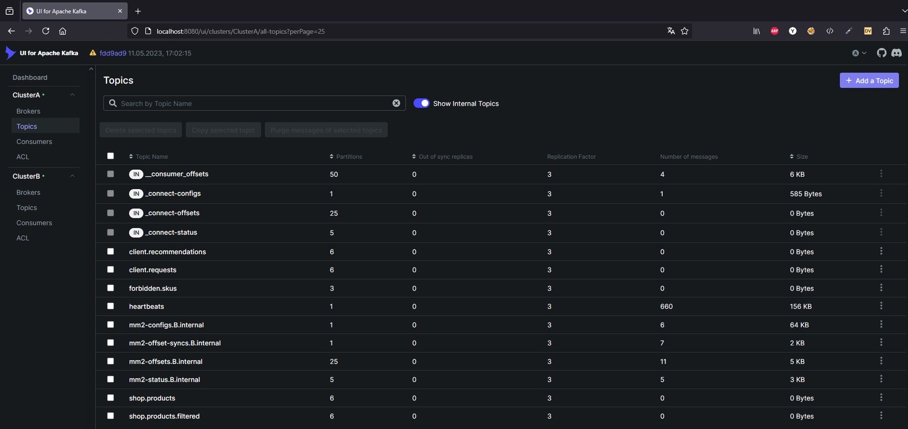
P.S Здесь же можно сразу в топик `forbidden.skus` добавить запись с запрещенным товаром, например, `XYZ-12345_forbidden`
6. Активировать Kafka Connect. В директории `infra/connect` выполнить команды
- `curl -X POST -H "Content-Type:application/json" --data @connector.json http://localhost:9085/connectors` - создаём коннектор
- `curl -s http://localhost:9085/connectors` - проверяем созданный коннектор
Должно получится как на скриншоте: 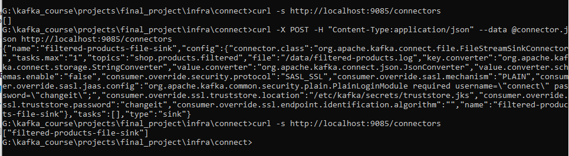
В директории `infra/connect/data` будет создан файл `filtered-products.log`, содержащий отфильтрованные продукты 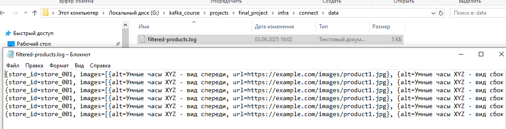
7. Запускаем теперь сами сервисы. В директории `apps` выполняем команду `docker-compose up -d`
- Проверяем записи в KafkaUI:
Товары были успешно записаны в топик `shop.products` 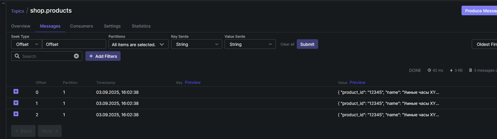
- Проверяем `shop.products.filtered`. Так как ранее добавили в топик `forbidden.skus` одну запись, то и в топике у нас не 3, а 2 записи 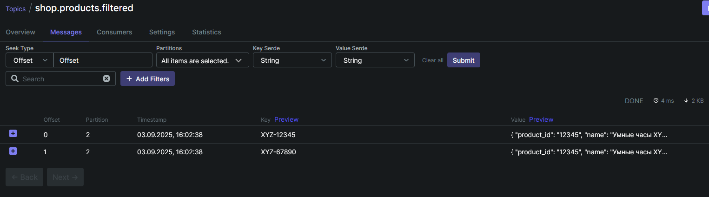
- Проверяем копирование в резервный кластер и систему рекомендаций. Т.к логика рекомендаций срабатывает каждые 30с,
то на скриншоте сразу видно 2 рекомендации 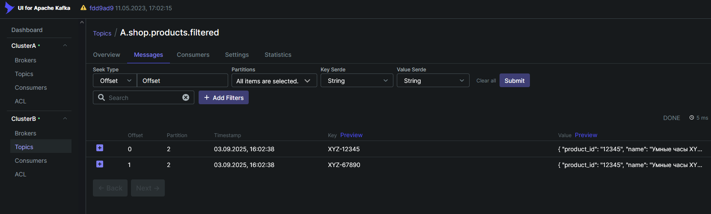
- Проверяем CLI. Выполняем команду `docker attach client-cli`. Нас встречает shell, можно сразу выполняить `help`, чтобы ознакомиться с доступнымит командами.
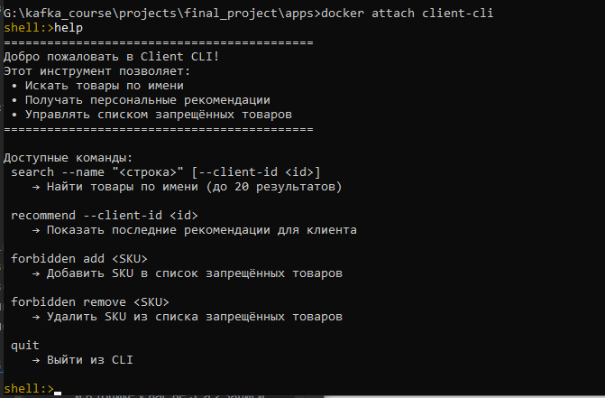
Проверим сразу рекомендации 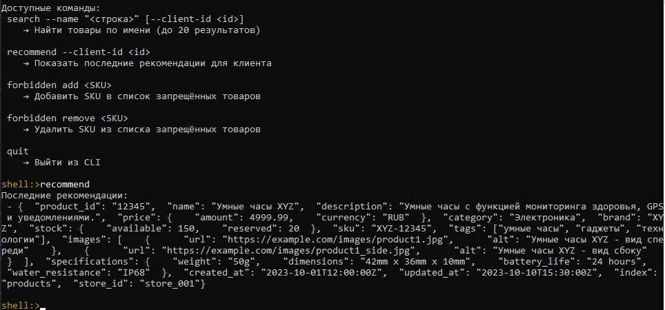.
- Проверим записи в БД 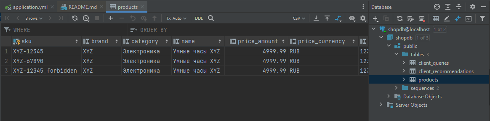
8. Проверяем Grafana:
- Переходим `http://localhost:3001`. Настроено несколько Dashboards 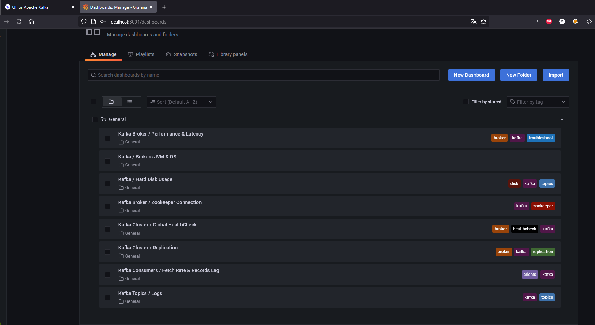
- Открываем любой, например, первый  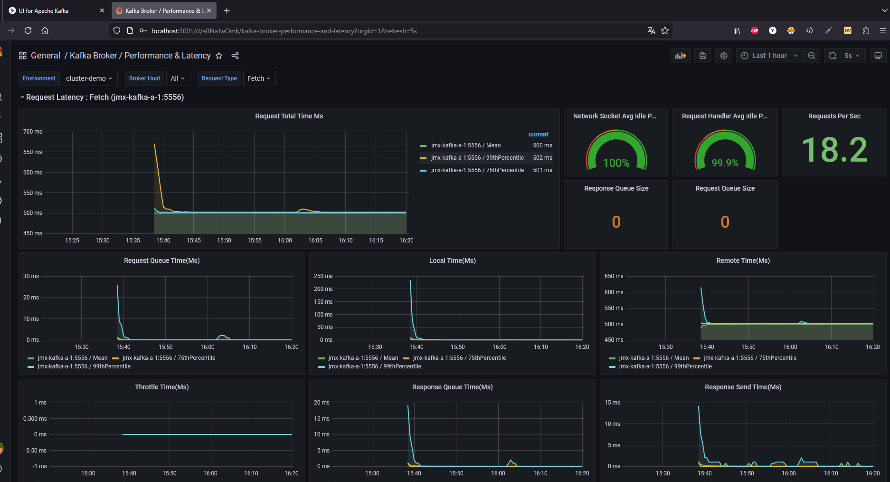
- так же настроен alert manager на telegram, можете ввести свой API ключ в файл `infra\monitor\alertmanager\config.yml` 